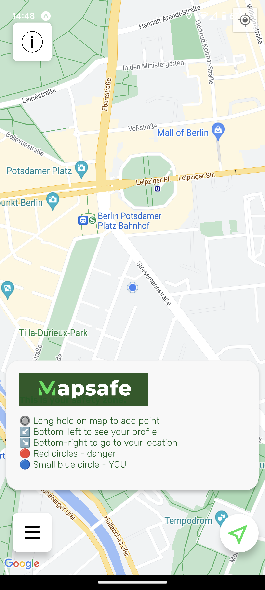
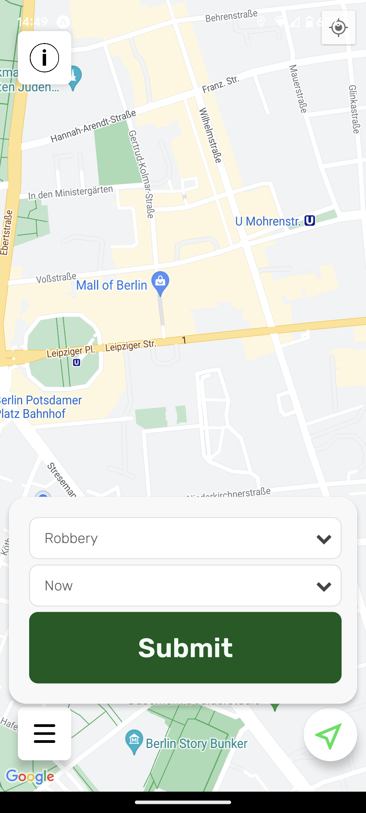
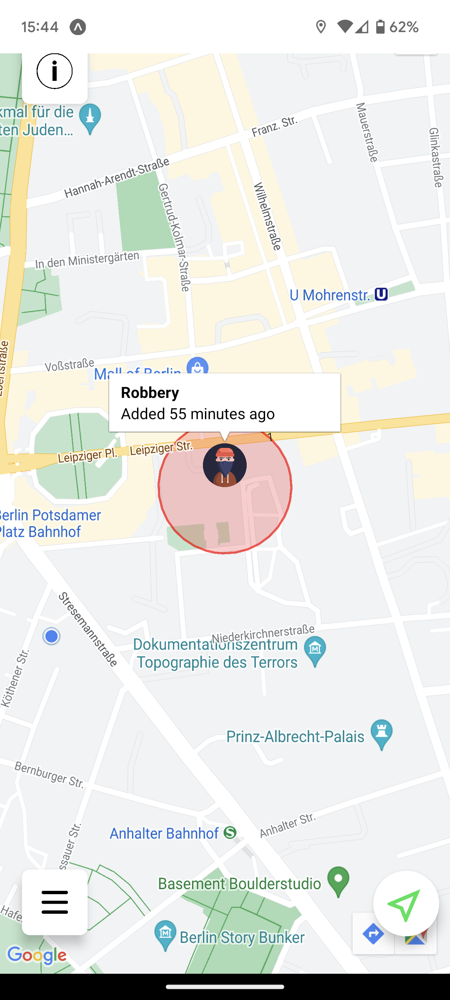
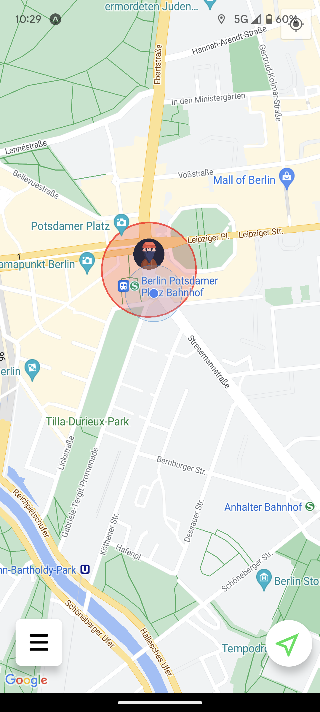
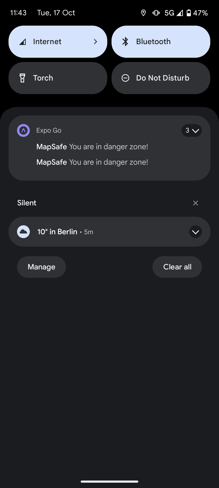
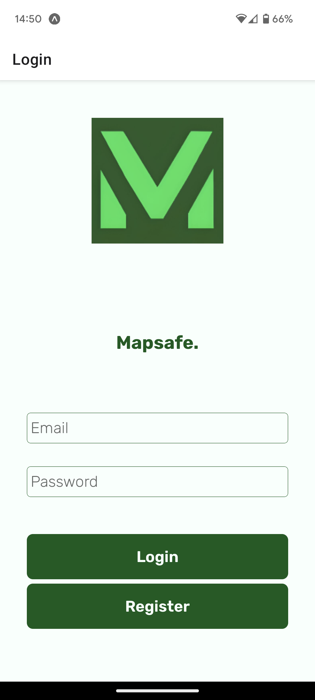
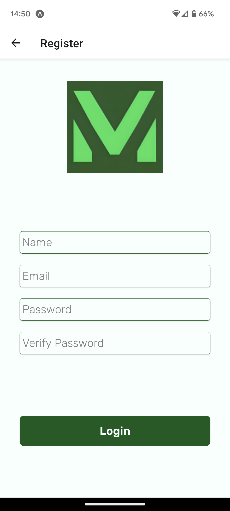
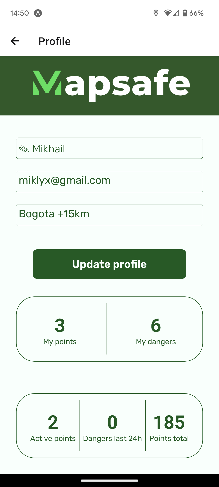
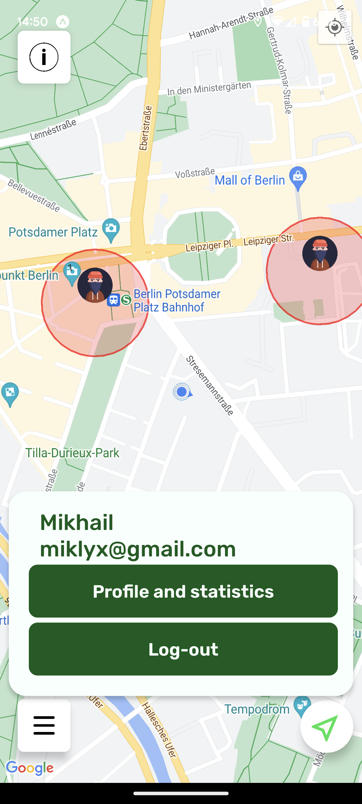

# MapSafe 🗺️

MapSafe is a mobile application designed to provide users with real-time insights into potential dangers in their vicinity. By leveraging cutting-edge technologies such as React Native and Firebase, MapSafe aims to offer peace of mind by enabling safer navigation in dynamic environments.

## How it looks


  
        

## Features 🌟

- **Real-time Danger Alerts**: View and identify dangers on a real-time map.

- **Firebase Authentication**: Secure and reliable user sign-up/sign-in processes.

- **Location Tracking**: Constantly updated user location, powered by Expo Location.

- **Push Notifications**: Immediate alerts via Expo notifications upon nearing a danger point.

- **Intuitive UI**: User-friendly interface with a focus on user experience.

## Tech Stack 💡


- **React Native**: For cross-platform mobile application development.

- **Expo**: A framework and platform for universal React applications.

- **Firebase**: Provides functionalities like authentication, real-time database, cloud functions, and Firestore.

- **Jira**: For project management and planning.

- **Git**: For version control.

- **Redux**: State management library for JavaScript applications, commonly used with React/React Native.

- **Express**: Minimal web application framework for Node.js, simplifying backend development.

- **Google Cloud Platform (GCP)**: Suite of cloud computing services by Google for building, deploying, and scaling applications.

- **Jest**: JavaScript testing framework developed by Facebook for writing unit tests.

- **GitHub**: Web-based platform for version control (Git) and collaborative software development.

- **CSS (Cascading Style Sheets)**: Stylesheet language controlling web page presentation and layout.

- **Discord**: Communication platform with voice, video, and text channels, popular for communities and gamers.

- **Regular Expressions (Regex)**: Patterns used for string matching, validation, and text manipulation tasks.

- **Visual Studio Code (VSCode)**: Free code editor by Microsoft with extensive features for various programming languages.

... _and many more_ ...

## Setup & Installation 🛠️

1. **Clone the Repository**:

   ```bash
   git clone https://github.com/SafemapBogotaBerlin/SafeMap.git
   cd SafeMap
   ```

1. install Dependencies:

   ```bash
   npm install

   ```

1. Set up Firebase:

Ensure you've set up a Firebase project. Add your Firebase project configuration to the appropriate file (e.g., firebaseConfig.js).

3. Run the Application:
   ```bash
   npx expo start --tunnel
   ```

## Insights & Challenges 🔍

Mobile development came with its unique set of challenges, especially concerning emulations.

Backend development was streamlined with Firebase, eliminating the need for traditional server setups in many cases.

Deployment, especially across different platforms, was a task in itself, reminding us that each platform has its intricacies.

## Contributing 🤝

Pull requests are welcome. For major changes, please open an issue first to discuss what you would like to change. Please ensure to update tests as appropriate.
